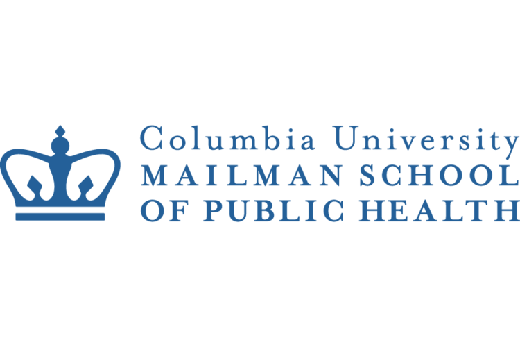

I am currently a second year Master of Public Health student in the [Epidemiology Department](https://www.publichealth.columbia.edu/academics/departments/epidemiology) at the [Columbia University Mailman School of Public Health](https://www.publichealth.columbia.edu/). I am pursuing a Certificate in [Applied Biostatistics and Public Health Data Science](https://www.publichealth.columbia.edu/academics/degrees/master-public-health/certificates/applied-biostatistics-and-public-health-data-science).

At Mailman, I currently work as a Research Assistant in for the [Global Health Justice and Governance Program](https://www.publichealth.columbia.edu/research/global-health-justice-and-governance) housed in the [Department of Population and Family Health](https://www.publichealth.columbia.edu/academics/departments/population-family-health) on a project [Analyzing Title X Funding Changes](https://www.publichealth.columbia.edu/research/global-health-justice-and-governance/domestic-gag-rule). I also work as a Teaching Assistant for [Quantitative Foundations](https://www.publichealth.columbia.edu/become-student/degrees/masters-programs/masters-public-health/modules#quantitative), a course in the CORE, the curriculum first years masters students take at Mailman.  

Prior to pursuing my MPH at Columbia, I lived and worked in Boston. At such time, I worked for two years as a Research Associate at [Optum Epidemiology](https://www.optum.com/business/solutions/life-sciences/epidemiology.html) at the same time that I served on the leadership board for [Boston Young Healthcare Professionals](https://byhp.org/).  

